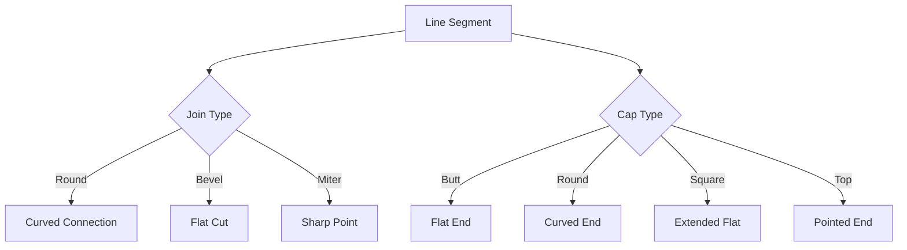
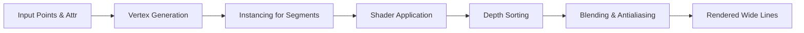

# Features

## Customizable attributes

The `attr` object can define color, width, opacity, and other per-segment metadata. Mix static values and attribute lists to animate attributes without rebuilding the geometry.

## Line joins and caps

Choose from built-in joins (`Round`, `Bevel`, `Miter`) and caps (`Butt`, `Round`, `Square`, `Top`). The shader computes the right vertices for each combination, so you can mimic SVG-style polylines inside Three.js scenes.

## Transparency and shader quality

Shaders are optimized for transparent strokes. Depth sorting and blending behave consistently across segments, letting you build layered canvases with crisp antialiased edges.

## Custom geometry and raycasting

Advanced users can supply custom geometry definitions for bespoke line shapes, while the optional raycasting support makes the lines interactive without extra effort.

## React integration

`Wideline` wraps the heavy logic in a React component that works inside `<Canvas>` from `@react-three/fiber`. The hooks and utilities play well with suspense, hooks, and modern React patterns.

## TypeScript-first

The project is shipped with full TypeScript declarations, ensuring every utility and prop is strongly typed. The generated API documentation helps you navigate the available interfaces, aliases, and helper functions.
