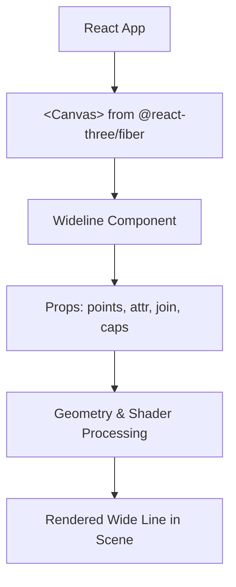

# Getting started

## Installation

Install `three-wideline` with your preferred package manager and include it in your React Three Fiber app.

```
pnpm add three-wideline
# or npm install three-wideline
# or yarn add three-wideline
```

`three-wideline` targets Node 18+ and relies on strict TypeScript typing, so the peer dependencies listed in `package.json` must match your React/Three.js stack.

## Quick start

The package exposes the `Wideline` component along with helper utilities such as `Logo`. Provide an array of points (three values per vertex) plus an attribute object to describe color, width, and other per-segment options.

```tsx
import { Canvas } from "@react-three/fiber"
import { Wideline } from "three-wideline"

function Scene() {
   const points = [-1, -1, 0, 1, 1, -1]
   const attr = { color: "red", width: 0.2 }

   return (
      <Canvas>
         <Wideline points={points} attr={attr} join="Round" capsStart="Round" capsEnd="Square" />
      </Canvas>
   )
}
```



Adjust `attr`, `join`, and cap settings to control the geometry that is rendered. The component builds instanced geometry under the hood, keeping draw calls tight even for long polyline paths.

## Samples

- `pnpm start` boots the local sample app located under `src/sample1`; browse the `build/sample1` output to see 2D and animated line variations.
- The README includes sandbox links (Logo and animated examples) that illustrate more complex setups.

## Building documentation and code

- `pnpm docs:api` regenerates the TypeDoc output under `docs/api`.
- `pnpm docs:build` runs both `docs:api` and the VitePress build.
- `pnpm build` produces the shipped sample app with `vite build`.
- Use `pnpm dist` when preparing the package for npm to ensure `dist` and typings are current.
