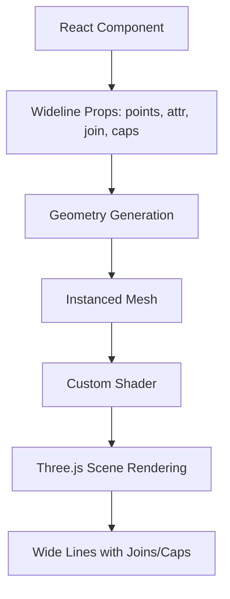

## Architecture Overview

Here's how `three-wideline` integrates into your Three.js and React Three Fiber setup:

## Guide Overview

- [Getting Started](getting-started) — Installation and sample usage
- [Features](features) — Rendering, caps, joins, and shader highlights
- [Performance Monitoring](PERFORMANCE.md) — Render and memory diagnostics
- [Development](development) — Tests, linting, docs, and build commands

## API Reference

The [API reference](/api/) is generated with TypeDoc and covers all available exports and types.

## Samples & Demos

Run `pnpm start` to serve the local sample. The README contains live Wideline examples and CodeSandbox links.
